# Alur Fitur Lengkap — LMS Bimbel (Subtle & 20for80)

> Dokumen turunan dari **PRD LMS Bimbel v1.2**. Berisi alur kerja (flow) tiap fitur untuk memudahkan developer mengimplementasikan logika bisnis, endpoint, dan state transition.
>
> **Referensi:** PRD_Subtlex20for80.pdf | **Status:** Siap Development

---

## Daftar Isi

1. [Ringkasan Arsitektur Peran](#1-ringkasan-arsitektur-peran)
2. [Alur Hierarki Kurikulum](#2-alur-hierarki-kurikulum)
3. [Alur Belajar Siswa (End-to-End)](#3-alur-belajar-siswa-end-to-end)
4. [Alur Mastery Gate (Kuis Pola Serupa)](#4-alur-mastery-gate-kuis-pola-serupa)
5. [Alur Remediasi (Wajib Tonton Ulang Video)](#5-alur-remediasi-wajib-tonton-ulang-video)
6. [Alur Gamifikasi (XP & Milestone)](#6-alur-gamifikasi-xp--milestone)
7. [Alur Admin — Manajemen Kurikulum](#7-alur-admin--manajemen-kurikulum)
8. [Alur Admin — Quiz Builder (Pattern Grouping)](#8-alur-admin--quiz-builder-pattern-grouping)
9. [Alur Admin — Override Mastery Gate](#9-alur-admin--override-mastery-gate)
10. [Alur API Kontraktual (Sequence)](#10-alur-api-kontraktual-sequence)
11. [State Machine — ChapterStatus](#11-state-machine--chapterstatus)
12. [Checklist Non-Fungsional](#12-checklist-non-fungsional)

---

## 1. Ringkasan Arsitektur Peran

| Peran | Workspace | Akses Utama |
|---|---|---|
| **Siswa** | Student Workspace | Kurikulum, video, kuis, raport, gamifikasi |
| **Admin** | Admin Workspace | CRUD kurikulum, Quiz Builder, audit, Override |

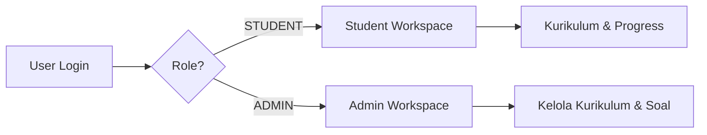

---

## 2. Alur Hierarki Kurikulum

Struktur data **wajib** tiga tingkat: `Materi → Bab → Chapter`.

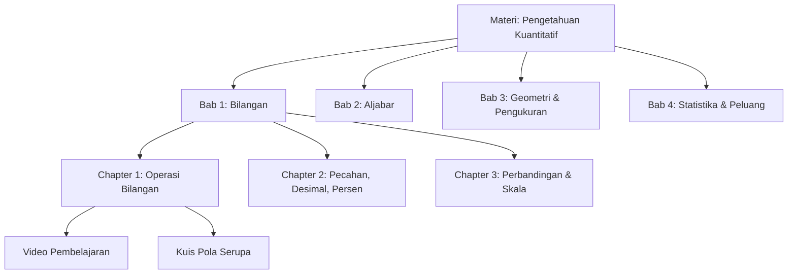

**Catatan implementasi:**
- Setiap `Chapter` memiliki 1 `videoUrl` dan minimal 1 `QuestionPattern`.
- Urutan Chapter dikontrol oleh field `orderIndex` (menentukan Chapter mana yang terbuka setelah Chapter sebelumnya lulus).
- Bab memiliki Pre Test (sebelum Chapter pertama) dan Post Test (setelah Chapter terakhir) — lihat §3.

---

## 3. Alur Belajar Siswa (End-to-End)

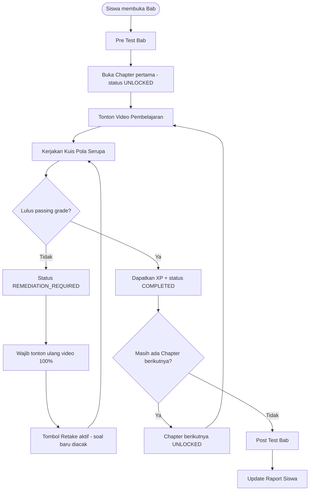

**Aturan kunci:**
- Siswa **tidak bisa** menekan "Next Chapter" sebelum status Chapter aktif = `COMPLETED`.
- Chapter yang masih terkunci ditampilkan **grayscale + ikon gembok**, tidak bisa diklik sama sekali (disabled di level UI *dan* diblokir di level API).

---

## 4. Alur Mastery Gate (Kuis Pola Serupa)

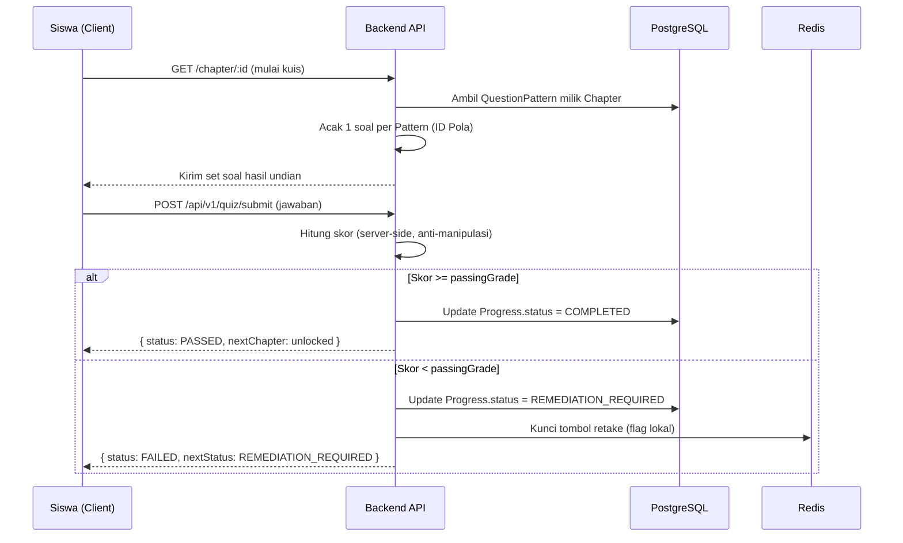

**Poin validasi wajib (server-side):**
1. Skor dihitung di server, **bukan** client — mencegah manipulasi via inspect element.
2. Soal yang gagal **tidak boleh** muncul persis sama pada retake — sistem mengundi ulang dari `QuestionPattern` (ID Pola) yang sama, tapi item `Question` berbeda.
3. Jika gagal, endpoint quiz **menolak** request retake sampai `videoWatchTimePct = 100`.

---

## 5. Alur Remediasi (Wajib Tonton Ulang Video)

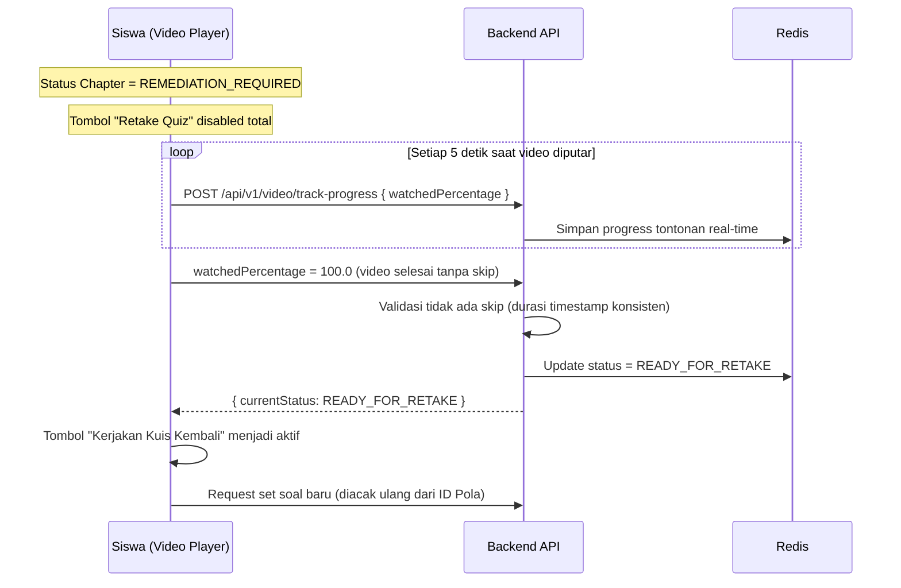

**Aturan ketat:**
- Video **tidak boleh di-skip**. Backend memvalidasi heartbeat 5 detik berurutan; lompatan waktu yang tidak wajar dianggap invalid dan tidak menambah `watchedPercentage`.
- Selama status `REMEDIATION_REQUIRED`, endpoint `quiz/submit` untuk Chapter tersebut **menolak** request (403) sampai status berubah `READY_FOR_RETAKE`.
- Field `videoWatchAttempts` pada model `Progress` bertambah tiap kali siklus remediasi terjadi — dipakai untuk data Raport.

---

## 6. Alur Gamifikasi (XP & Milestone)

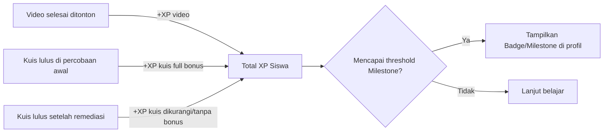

**Catatan:** PRD menyebutkan XP didapat dari video selesai ditonton dan kuis yang **berhasil di percobaan awal** — disarankan tim produk mengonfirmasi apakah kuis yang lulus setelah remediasi tetap mendapat XP (penuh/berkurang), karena ini memengaruhi skema poin di backend.

---

## 7. Alur Admin — Manajemen Kurikulum

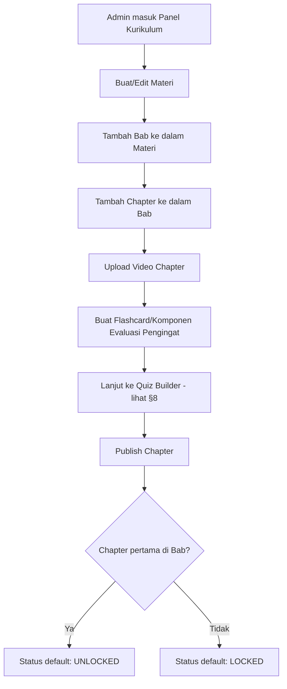

CRUD penuh (Create, Read, Update, Delete) berlaku di tiap level: Materi, Bab, Chapter.

---

## 8. Alur Admin — Quiz Builder (Pattern Grouping)

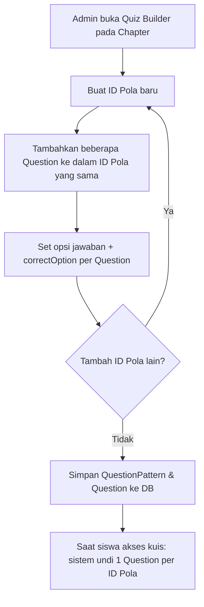

**Contoh struktur data:**
- `QuestionPattern` (patternCode: "Rumus Cepat Pecahan") memiliki 5 `Question` dengan angka/variabel berbeda tapi logika penyelesaian sama.
- Saat siswa retake, sistem mengundi ulang **Question lain** dari `QuestionPattern` yang sama agar tidak identik dengan percobaan sebelumnya.

---

## 9. Alur Admin — Override Mastery Gate

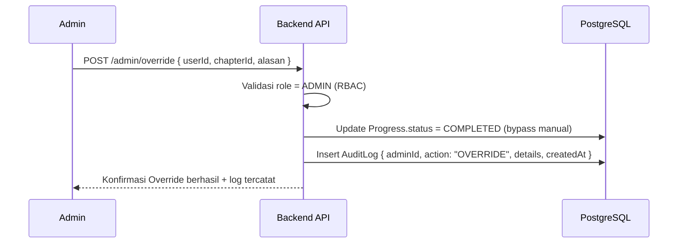

**Wajib dicatat di `AuditLog`:** ID Admin, nama siswa, alasan override, timestamp — untuk keperluan audit trail dan transparansi.

---

## 10. Alur API Kontraktual (Sequence)

### 10.1 `POST /api/v1/quiz/submit`
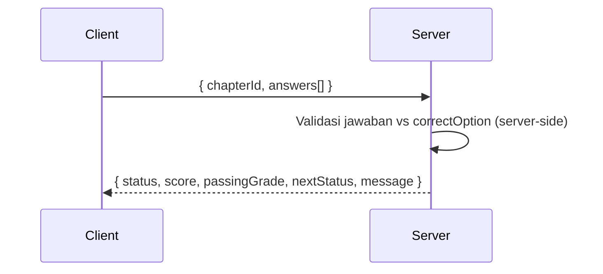

### 10.2 `POST /api/v1/video/track-progress`
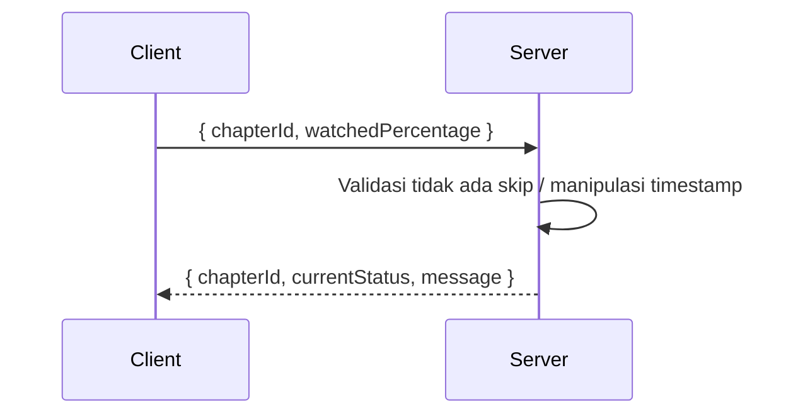

> Kedua endpoint ini adalah titik kritis keamanan — **semua logika kelulusan dan validasi tontonan wajib di server**, token pelacakan video dienkripsi.

---

## 11. State Machine — ChapterStatus

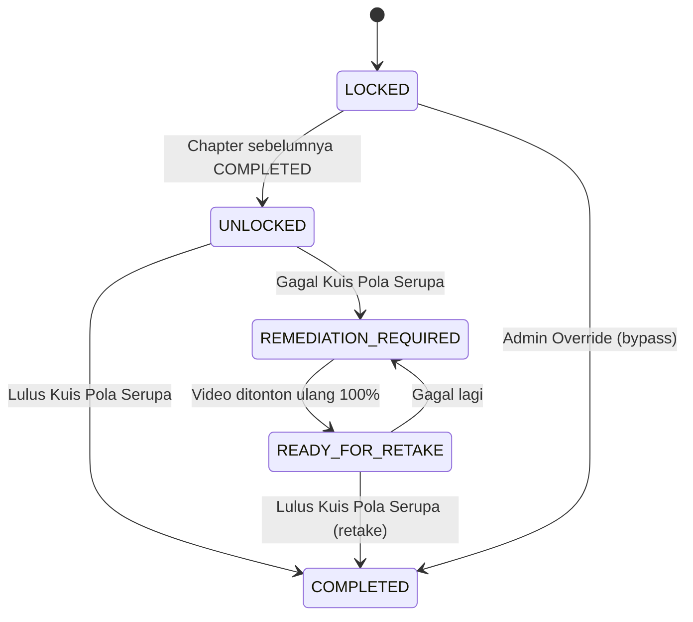

| Status | Deskripsi | Trigger |
|---|---|---|
| `LOCKED` | Chapter belum bisa diakses | Default, Chapter sebelum belum `COMPLETED` |
| `UNLOCKED` | Chapter bisa diakses, kuis belum dikerjakan/lulus | Chapter sebelumnya `COMPLETED` |
| `COMPLETED` | Siswa lulus kuis | Skor ≥ passing grade |
| `REMEDIATION_REQUIRED` | Gagal kuis, retake terkunci | Skor < passing grade |
| `READY_FOR_RETAKE` | Video sudah ditonton ulang 100% | `track-progress` = 100.0 |

---

## 12. Checklist Non-Fungsional

- [ ] Waktu muat komponen kuis interaktif **< 2 detik**
- [ ] Validasi kelulusan Mastery Gate **100% server-side**
- [ ] Token pelacakan durasi video **terenkripsi**
- [ ] Halaman kuis/flashcard **responsif** (mobile & tablet)
- [ ] Kontras warna sesuai **WCAG 2.1** (khusus tema hijau dominan)
- [ ] Komponen terkunci: **grayscale + ikon gembok**, non-interaktif di level UI dan API
- [ ] `AuditLog` tercatat untuk setiap aksi Override Admin

---

## Referensi Tech Stack Singkat

| Layer | Teknologi |
|---|---|
| Frontend | Next.js 14+ (App Router), TypeScript, Tailwind CSS, Shadcn/Radix, Zustand |
| Video Player | Video.js / Plyr (custom wrapper anti-skip) |
| Backend | Node.js + NestJS, TypeScript, Prisma ORM |
| Auth | JWT + HttpOnly Cookie, RBAC |
| Database | PostgreSQL |
| Cache/Session | Redis |
| Object Storage | AWS S3 / Cloudflare R2 / DigitalOcean Spaces |
| Infra | Docker, GitHub Actions CI/CD, Vercel/AWS/Render |

---

*Dokumen ini disusun sebagai panduan implementasi alur kerja bagi tim developer, berdasarkan PRD LMS Bimbel v1.2 (Subtle & 20for80).*
